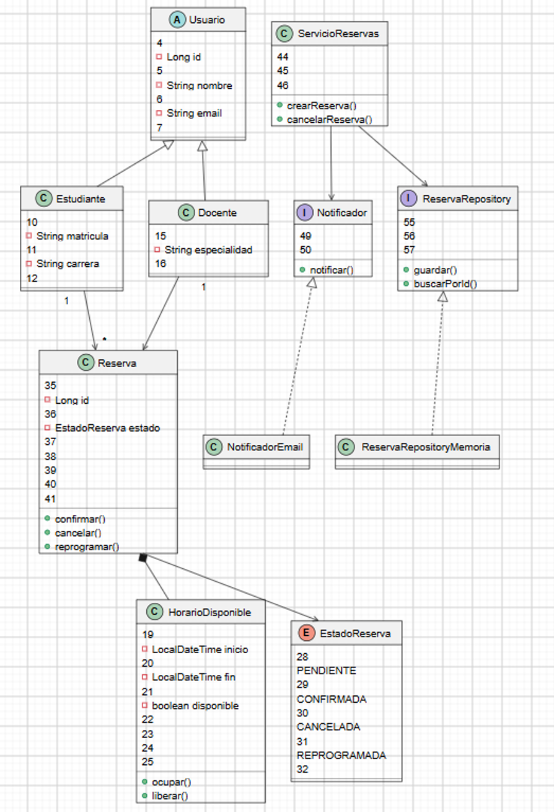
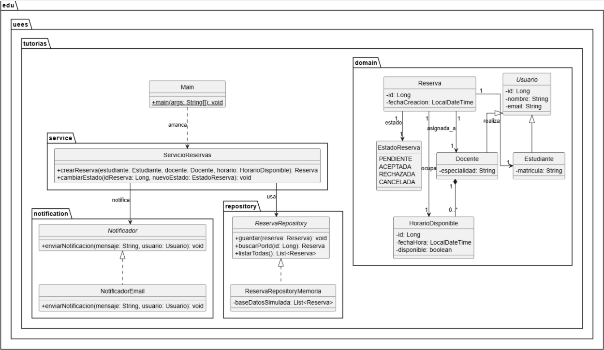
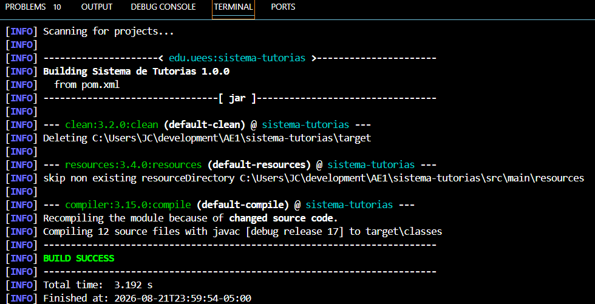

Diseño de Software - UCOM0310_AE1_Diseno00

## Información general

- **Universidad:** Universidad Espíritu Santo
- **Carrera:** Computación
- **Asignatura:** Diseño de Software
- **Código:** UCOM0310
- **Periodo:** PEL 4 - 2026
- **Estudiante:** Santiago Campoverde
- **Docente:** Ph.D. Jaime Paul Sayago Heredia

## Descripción

Los estudiates tienen la necesidad de realizar reservas para sus clases online, por ese motivo se considera como solucion la implemetacion de un Sistema de Tutorias para Estudiantes y Profesores UEES

## Clases Principales

Docente
EstadoReserva
Estudiante
HorarioDisponible
Reserva
Usuario
Notificador
NotificadorEmail
ServicioReservas
Main

## Tecnologías

- Java 21
- Apache Maven 3.9.x
- Git y GitHub
- PlantUML

## Requisitos previos

- JDK 21 instalado.
- Maven disponible en PATH.
- Git configurado.

## Decisiones del diseno relevantes

-Decisiones Documentadas
SRP
DIP
-Decisiones de Arquitectura
Arquitectura en Capas
Modelo de Dominio
Documentacion con PlantUML
Automatizacion con MAVEN

## Principios SOLID

SRP Single Responsibility Principle 
DIP Dependency Inversion Principle 

## Enlace GitHub

https://github.com/scampoverde/sistema-tutorias.git
mvn clean test

## Imagenes del diagrama UML

## Comando de compilación (mvn clean compile)

## Estructura del proyecto

README.md
pom.xml

Volume serial number is 5850-6469
C:.
├───docs
└───src
    ├───main
    │   └───java
    │       └───edu
    │           └───uees
    │               └───tutorias
    │                   ├───domain
    │                   ├───notification
    │                   └───service
    └───test
        └───java

## Uso de inteligencia artificial

Durante el desarrollo de esta actividad utilicé COPILOT.
La utilicé para asistencia de la elaboración del documento y realización del código.
Verifiqué y adapté las respuestas obtenidas, puedo explicar el código y las decisiones presentadas.

## Autor

SANTIAGO CAMPOVERDE
santiago.campoverde@uees.edu.ec
